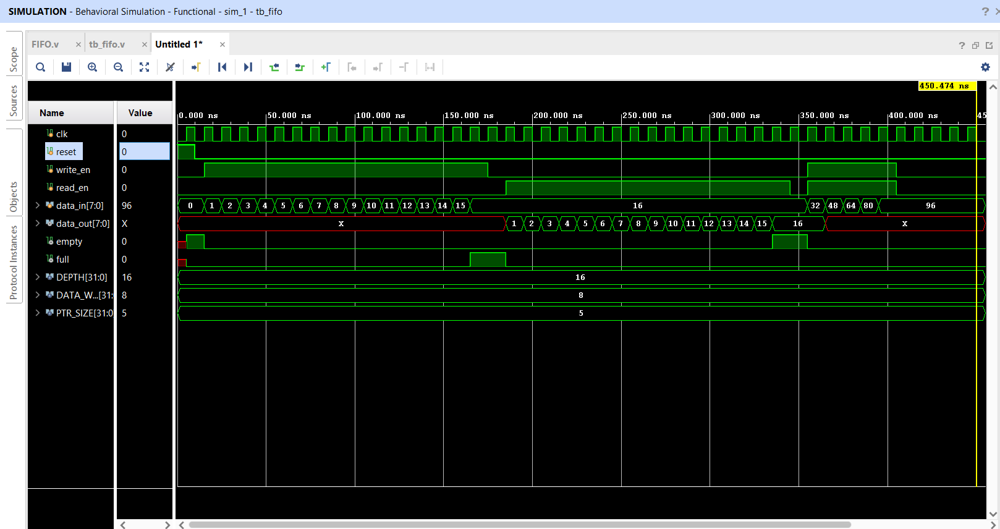

# Synchronous FIFO (Verilog)

This project implements a synchronous FIFO using Verilog.

## Features
- Single clock FIFO
- Pointer-based read/write
- Full and Empty flag logic
- Supports simultaneous read and write
- Verified using testbench

## Files
- `FIFO.v` – FIFO RTL
- `tb_fifo.v` – Testbench
- `wfs.png` – Simulation waveform
- 
## Simulation Waveform

Below is the simulation waveform of the FIFO:

## Description
The FIFO stores data in memory and outputs in the same order it was written.
A counter is used to track the number of stored elements.

## Applications
- SoC buffering
- Data streaming
- Producer–consumer systems

