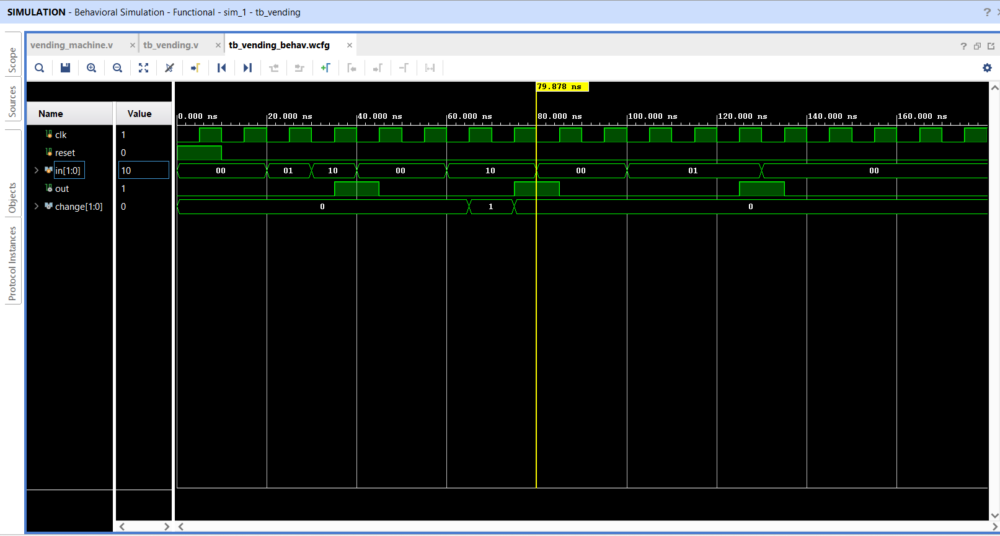

# Vending Machine Controller (FSM)

Designed a vending machine using FSM in Verilog.
Features: coin input, product dispense, and change return.

Tools: Verilog, Xilinx Vivado
## Simulation Waveform

Below is the simulation result of the FSM-based vending machine:

